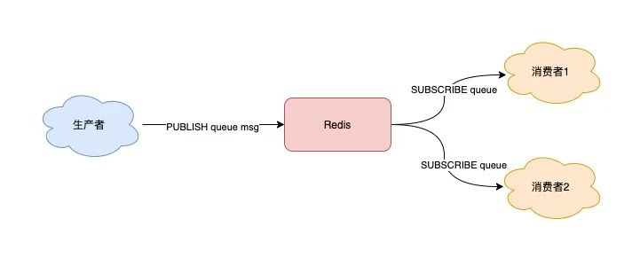
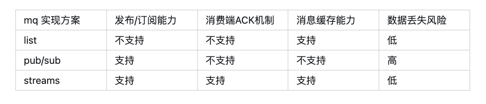
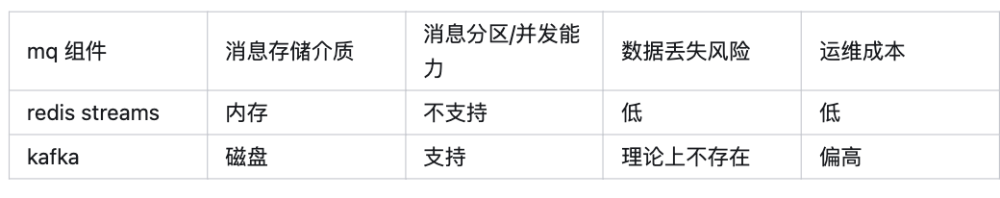

# Redis做消息队列

## 订阅-发布模型

适用于多个生产者多个消费者的使用场景

### 流程

1. 消费者订阅同一个队列，然后阻塞住，等待生产者
2. 生产者发布消息时，消费者接触阻塞，拉取数据

### 缺点

**丢数据** :

1. 生产者发布消息时，消费者下线，丢失消息(缺少ack机制)
2. 当消费者读取的速度跟不上生产者发布的速度时，可能会出现**消息积压**，对此，redis采用的是缓冲区策略，一
旦缓冲区满了，就会把一些消费者踢出
3. 不支持消息的持久化(redis仅有aof，且不支持订阅发布模型)

### 优点

1. 可以轻松扩展到多个生产者消费$$者
2. 支持消费者订阅不同的频道

### 与其他各种消息队列的对比

1. Redis几种消息队列的对比

2. Redis消息队列和其他消息队列的对比

