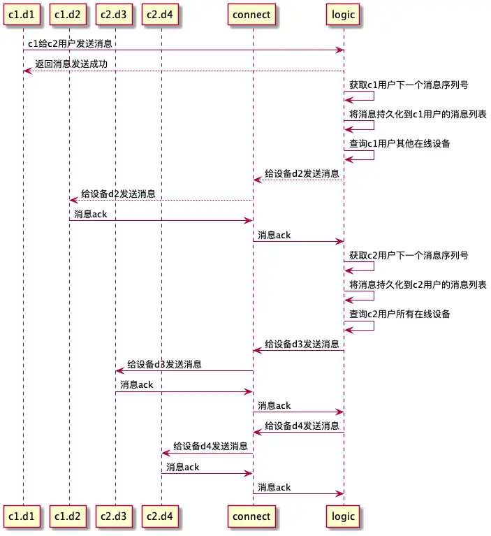

# 单聊实现逻辑

## 架构图

单聊流程解析：

1. 获取该用户下一个seq
2. 将消息持久化到用户的消息列表，包含该发送者对应的seq等
3. 发送给其他设备
4. 设备返回ack给conn-server
5. conn-server返回ack给logic-server
6. 给接受者的所有设备发消息，类似前三步的操作

(如果是发送给发送者自己的其他设备，注意不要发送给当前设备)

### ack逻辑

用户收到消息后，发送ack给connect服务器，connect服务器把ack传给logic-server

这里为什么不用mysql？：因为ack实际上需要频繁更新，如果放到一个表中，压力过大，所以其实不需要持久化，因此采用redis的hash存储即可

### 为什么接收ack通过connect服务器？

返回ack是一个频繁更新的操作，并且每一个客户端都会返回ack，因此需要传递给conn-server，另外这里也可以用多个conn-server来缓解压力

### 如何获取下一个seq

详见 `seq_repo.go`

采用**事务**的方式，获取下一个seq，并在数据库里把seq+1，这样可以保证seq的一致性
