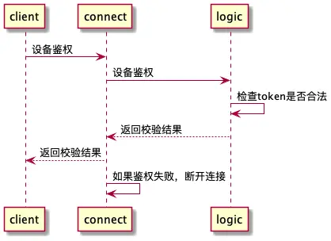

# 客户端接入流程

## 1. 注册

调用logic-server的注册接口，注册成功后，返回device id，设备第一次安装时，需要调用该接口

## 2. 登录

### 2.1 获取userId和token

调用business-server的登录接口，完成账户登录，登录成功后，返回token，userId

### 2.2 长连接登录

1. conn-server进行鉴权
2. conn-server向logic-server发起登录请求
3. logic-server调用business-server的鉴权接口
4. 返回校验结果给conn-server
5. conn-server返回校验结果给客户端

通信协议：

1. conn-server和客户端采用websocket进行通信

2. conn-server和logic-server之间采用grpc通信

登录后，logic-server会把设备信息存入mysql，并维护redis的缓存一致性

**登录报文格式:**

- Token
- UserId
- DeviceId

#### websocket通信

客户端按照protocol协议组装消息，序列化数据，通过websocket发送给conn-server

conn-server接收到消息后，进行反序列化，进行业务处理, 这里第一个包应该是登录包
