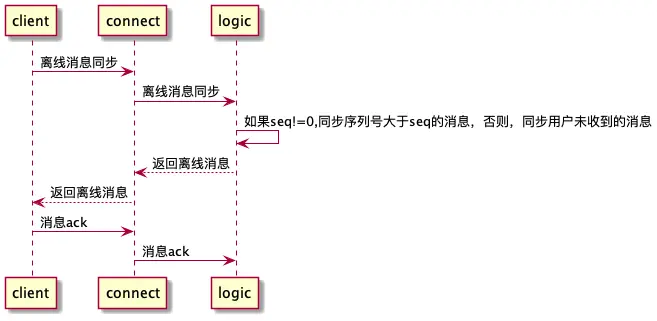
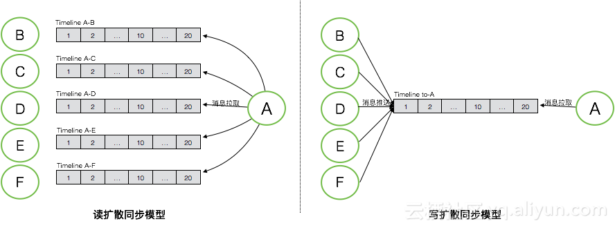

# 消息同步

## 架构图

## 原理

每个用户都会维护一个自增的序列号，当用户A给用户B发送消息时，首先会获取A的最大序列号，设置为这条消息的seq，持久化到用户A的消息列表， 再通过长连接下发到用户A账号登录的所有设备，再获取用户B的最大序列号，设置为这条消息的seq，持久化到用户B的消息列表，再通过长连接下发到用户B账号登录的所有设备。
假如用户的某个设备不在线，在设备长连接登录时，用本地收到消息的最大序列号，到服务器做消息同步，这样就可以保证离线消息不丢失。

注意：seq字段是客户端接收到消息的最大同步序列号，如果用户是换设备登录者第一次登录，seq应该传0。

如果seq传0，则会通过查找device ack缓存来获取被响应的最大seq，然后再同步消息

## 流程

- 登录后，客户端向conn-server发送一个消息同步包，包含用户的最大seq
- conn-server向logic-server进行通信，logic-server去message表中查找seq大于等于用户最大seq的消息
- 如果消息的字节数超过了tcp的最大包长度，则减少字节数组为2/3
- 客户端收到消息后，返回ack给conn-server
- conn-server返回ack给logic-server

## 消息同步模型

消息同步模型一般分为两种，读扩散和写扩散

**读扩散**： 每一个会话的timeline表中存储了这个会话所有的消息，消息同步模式下，每次会话又更新，只需要存入它对应的timeline表，**消息同步时，客户端需要去各个timeline表去查找消息**，这样的坏处是产生大量无效的读，因为不是每个会话都有新消息产生

**写扩散**：采用一个timeline表来存储消息，每个会话的消息会进行多次写，除了要写入本人timeline中，还需要写入其他接收者的timeline中，如果是群聊，还需要写入到每一个用户的timeline中，**消息同步时，接收端只需要从自己的timeline中读取一次即可**

IM的场景下，通常会采用写扩散的方式，因为IM场景下，基本上是读多写少的情况，消息的读写比例大概是10:1。若使用读扩散同步模式，整个系统的读写比例会被放大到100:1。当然对于复杂的IM系统，可能需要兼读扩散和写扩散。