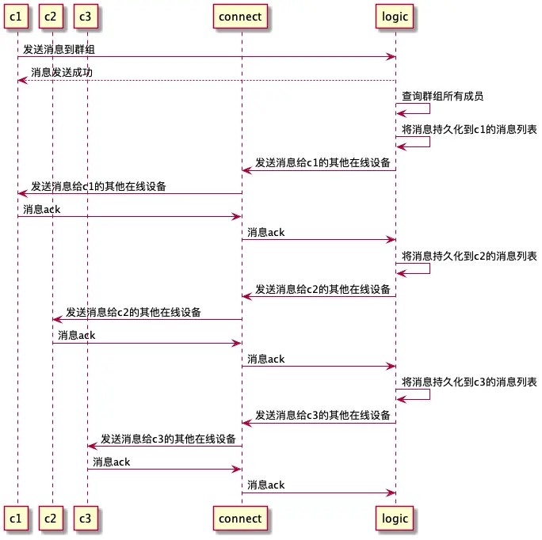

# 群聊实现逻辑

## 架构图

## 流程

1. 获取群聊所有成员
2. 获取该用户下一个seq
3. 将消息持久化到用户的消息列表，包含该发送者对应的seq等
4. 发送给其他设备
5. 发送给每个成员的每个设备（启动多个goroutine）

群聊部分主要采用写扩散实现

## 写扩散的特点

1. 性能优势：

读取效率高：用户只需要从自己的timeline读取消息
适合IM场景：IM通常是读多写少（读写比约10:1）
减少系统负载：避免了读扩散模式下的大量无效读取

2. 功能优势：

消息同步简单：设备只需同步自己的消息列表
离线消息处理方便：设备重连时可直接获取未读消息
支持消息回执：每个用户独立维护消息状态
